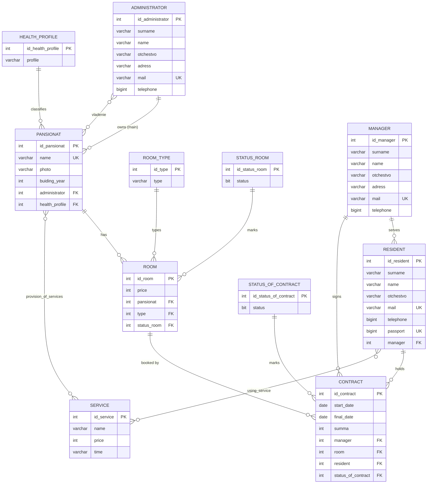

# Sanatorium API

REST API over a SQL Server database for a sanatorium (health resort) network.
The service backs two workstations — **administrator** and **manager** — with 18
endpoints for CRUD and analytics, on top of a T-SQL layer of stored procedures,
triggers, CHECK constraints and benchmark scripts.


> Coursework project (АРМ администратора / АРМ менеджера), written to practise
> relational modelling, T-SQL and REST API design. The business processes it
> implements are described in [docs/business-requirements.md](docs/business-requirements.md).

---

## Quick start

Everything below runs with Docker only — no local SQL Server, no ODBC driver setup.

```bash
git clone https://github.com/Ypsidshi/SanatoriumPythonFastApi.git
cd SanatoriumPythonFastApi
docker compose up --build
```

Three containers start in order:

1. `mssql` — SQL Server 2022 (Developer edition)
2. `db-init` — one-shot container that creates the `sanatorium` database with a
   Cyrillic collation and applies `sql/*.sql` (schema → constraints → demo data →
   routines), then exits
3. `api` — the FastAPI app

Open **http://localhost:8000/docs** for Swagger UI, or check
`curl http://localhost:8000/health`.

The demo data from `sql/03_seed_mssql.sql` gives you 2 pansionats, 3 rooms,
2 residents and 2 contracts, so every analytics endpoint returns something on the
first call.

Shut down and drop the database volume:

```bash
docker compose down -v
```

If `make` is available, `make help` lists the same operations as short targets.

## What is inside

| Layer | Contents |
| --- | --- |
| API | FastAPI + Pydantic v2, 18 endpoints grouped into Admin / Manager / System tags in Swagger |
| ORM | SQLAlchemy 2.0 declarative models mirroring the SQL schema, including 3 association tables |
| Analytics | Aggregate queries: occupancy, revenue and average cheque per pansionat, service availability, top services, contracts by status and by room type |
| T-SQL | 12 stored procedures, 4 triggers, 4 views, 39 CHECK constraints, a table-space report and benchmark scripts using `STATISTICS IO/TIME` |
| Data generation | `scripts/seed_mssql.py` — parameterised generator for bulk service rows; `sql/04_seed_mass_mssql.sql` — mass insert for load testing |

## Endpoints

| Group | Method | Path | Purpose |
| --- | --- | --- | --- |
| Admin: Pansionat | `POST` | `/api/pansionats` | Create a pansionat and link administrators and services in one transaction |
| Admin: Pansionat | `PUT` | `/api/pansionats/{id}` | Update fields and re-link services / administrators |
| Admin: Pansionat | `DELETE` | `/api/pansionats/{id}` | Delete a pansionat (cascades to rooms and contracts) |
| Admin: Analytics | `GET` | `/api/pansionats/availability` | Service count per pansionat |
| Admin: Analytics | `GET` | `/api/pansionats/stats` | Pansionat count grouped by building year |
| Admin: Analytics | `GET` | `/api/admin/pansionats/summary` | Pansionats, rooms, residents and services owned by one administrator |
| Admin: Analytics | `GET` | `/api/admin/contracts/revenue` | Revenue and average cheque per pansionat in a period |
| Admin: Analytics | `GET` | `/api/admin/services/top` | Most widely offered services across the administrator's pansionats |
| Admin: Analytics | `GET` | `/api/admin/table/{table_name}` | Dump one whitelisted table (debug / demo helper) |
| Manager: Contracts | `POST` | `/api/contracts` | Create a residence contract |
| Manager: Contracts | `PUT` | `/api/contracts/{id}` | Update contract fields |
| Manager: Contracts | `DELETE` | `/api/contracts/{id}` | Delete a contract |
| Manager: Analytics | `GET` | `/api/contracts/occupancy` | Contracts overlapping a period, per pansionat |
| Manager: Analytics | `GET` | `/api/contracts/revenue` | Revenue and average cheque per pansionat |
| Manager: Analytics | `GET` | `/api/manager/contracts/status` | The manager's contracts grouped by status |
| Manager: Analytics | `GET` | `/api/manager/contracts/period` | The manager's totals for a period |
| Manager: Analytics | `GET` | `/api/manager/rooms/types` | The manager's contracts grouped by room type |
| System | `GET` | `/health` | Liveness probe |

Request and response examples for every endpoint:
[docs/manual-api-tests.md](docs/manual-api-tests.md).

## Data model

11 entity tables and 3 association tables.



## SQL scripts

| Script | Purpose |
| --- | --- |
| `sql/01_schema_mssql.sql` | Tables, primary and foreign keys, identity columns |
| `sql/02_operations_mssql.sql` | Stored procedures, triggers and views for the business rules |
| `sql/03_seed_mssql.sql` | Small demo dataset |
| `sql/04_seed_mass_mssql.sql` | Bulk data for load and index testing |
| `sql/05_space_report_mssql.sql` | Per-table row count and space usage report |
| `sql/06_constraints_mssql.sql` | CHECK constraints: mail format, phone and passport ranges, Cyrillic-only names, positive prices, date ordering |
| `sql/07_bench_*.sql` | Benchmark harnesses for the admin and manager analytics queries |
| `sql/01_schema.sql`, `sql/02_operations.sql` | Original MySQL version |
| `sql/*_postgres.sql` | PostgreSQL port |

The MySQL and PostgreSQL variants are kept for reference only — **SQL Server is
the supported target**, and the only one the API and the ORM models track.

Business rules implemented as triggers:

- adding a service to a pansionat raises the price of its other services
- a pansionat with the `сердечно-сосудистый` health profile gets a 20% discount
  on its services
- contracts booked far in advance get an early-booking discount
- contracts are auto-closed once the check-out date has passed

## Running without Docker

Requires Python 3.11, SQL Server, and the
[Microsoft ODBC Driver 18](https://learn.microsoft.com/sql/connect/odbc/download-odbc-driver-for-sql-server).

```bash
python -m venv .venv
.venv/Scripts/activate          # Linux/macOS: source .venv/bin/activate
pip install -r requirements.txt -r requirements-dev.txt

cp .env.example .env            # then edit DATABASE_URL

python -m scripts.init_db       # create the database and apply sql/*.sql
uvicorn app.main:app --reload
```

`app/db.py` reads `DATABASE_URL` from the environment (or from a local `.env`)
and fails fast if it is missing — there are no credentials in the source.

The pins in `requirements.txt` target Python 3.11: SQLAlchemy 2.0.30 does not
import on Python 3.13+.

## Tests

```bash
pytest -q tests
```

`tests/test_api_smoke.py` sends real HTTP requests, so it needs a running API —
start the stack first, or point it elsewhere with `BASE_URL=http://host:port`.

## Project layout

```
app/
  main.py        FastAPI app: routes, analytics queries, table whitelist
  models.py      SQLAlchemy models and association tables
  schemas.py     Pydantic request DTOs
  db.py          engine, session factory, get_db dependency
scripts/
  init_db.py     create the database and apply sql/*.sql (used by docker compose)
  seed_mssql.py  parameterised generator for bulk service rows
sql/             T-SQL schema, routines, constraints, seeds, benchmarks
tests/           HTTP smoke tests
docs/            business requirements, manual API test cases
```

## Known limitations

- No authentication or authorisation: the administrator / manager split exists in
  the route layout and the data model, not in enforced access control.
- The API reaches the tables through SQLAlchemy; the stored procedures in
  `sql/02_operations_mssql.sql` implement the same operations independently and
  are not called from Python.
- The smoke tests hit a live server rather than an isolated test database, so
  they cannot run in CI as-is.
- Some column names carry typos frozen into the original schema
  (`buiding_year`, `adress`) and one transliterated table name (`vladenie`); they
  are kept as-is so the SQL scripts, the ORM models and the reports stay
  consistent with each other.

## License

MIT — see [LICENSE](LICENSE).
